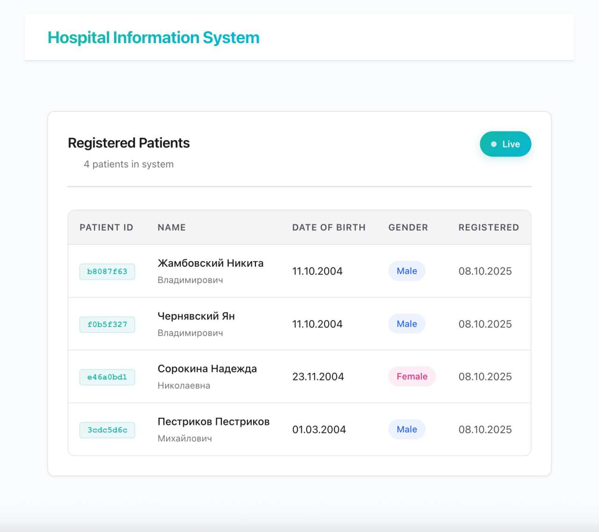

# Hospital Chief UI

Frontend для системы мониторинга пациентов главврачом медицинского учреждения.

## Технологии

- **Svelte** - реактивный UI фреймворк
- **Vite** - сборщик и dev-сервер
- **WebSocket** - real-time обновления списка пациентов

### Почему Svelte?

- **Компилятор вместо runtime** - нет лишнего кода фреймворка в браузере, меньше бандл
- **Встроенная реактивность** - не нужны useState/useMemo/useCallback, просто `let count = 0`
- **Меньше boilerplate** - `bind:value` вместо value + onChange, встроенные stores
- **Автоматическая оптимизация** - точные обновления DOM без Virtual DOM diffing

## Архитектура

```
src/
├── components/
│   ├── PatientTable.svelte
│   └── App.svelte
├── stores/
│   └── patients.js
├── services/
│   ├── api.js
│   └── websocket.js
└── styles/
    └── global.css
```

## Основная логика

### Просмотр пациентов
- Read-only интерфейс без форм редактирования
- Сортировка по дате регистрации (новые сверху)
- Отображение UUID пациента из HIS с функцией копирования
- Цветовая индикация пола (синий/розовый)
- Fade-in анимации при загрузке
- Empty state с иконкой при отсутствии данных

### Real-time обновления
- WebSocket подключение к Hospital Server
- Автоматическое добавление новых пациентов в таблицу
- Автоматическое удаление при получении события
- Auto-reconnect при разрыве соединения
- Live badge с пульсирующей точкой

### API
- Все запросы через Vite proxy (избегаем CORS)
- WebSocket соединение напрямую к Hospital Server (ws://localhost:8081/ws)
- Обработка ошибок с отображением в UI

## Скриншоты

### Dashboard с таблицей пациентов

