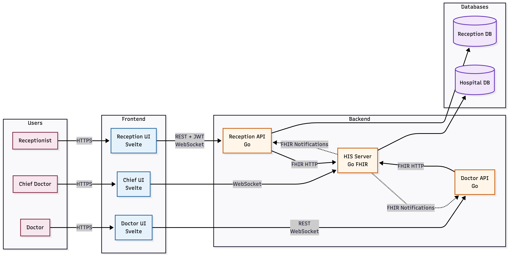

# Медицинская информационная система

Микросервисная система управления приемным отделением больницы с защищенной интеграцией HL7 v2 и FHIR R4 для регистрации пациентов и управления визитами.

## Описание

Система предоставляет полное решение для работы приемного отделения больницы, включая регистрацию пациентов, планирование визитов и синхронизацию данных в реальном времени с госпитальной информационной системой (ГИС). Построена с использованием современных веб-технологий и стандартов здравоохранения.

## Основные возможности

- **Регистрация пациентов** - Создание и управление записями пациентов с автоматической синхронизацией в ГИС
- **Защищенная передача HL7** - MLLP поверх TLS для шифрованной передачи медицинских данных
- **Интеграция FHIR R4** - Современный API здравоохранения для управления визитами и врачами
- **Обновления в реальном времени** - WebSocket-уведомления для мгновенного обновления интерфейсов
- **Асинхронная обработка** - Система корреляции сообщений для надежной связи с ГИС
- **Ролевой доступ** - Отдельные интерфейсы для регистратуры, врачей и администраторов

## Архитектура

Система состоит из шести независимых микросервисов:

**Backend сервисы:**
- **Reception API** (Go) - CRUD операции с пациентами, обработка HL7 сообщений
- **Doctor API** (Go) - Управление визитами врача, интеграция с FHIR
- **Hospital Server** (Go) - Имитация ГИС с HL7/FHIR endpoints

**Frontend приложения:**
- **Reception UI** (Svelte) - Интерфейс регистратуры с live-обновлениями
- **Doctor UI** (Svelte) - Интерфейс врача для работы с визитами
- **Hospital Chief UI** (Svelte) - Административный интерфейс главврача



### Протоколы взаимодействия

- **HL7 v2.5** - Сообщения ADT^A04 (создание пациента), ADT^A23 (удаление) через MLLP
- **FHIR R4** - REST API для ресурсов Encounter и Practitioner
- **WebSocket** - Push-уведомления для обновления интерфейсов
- **TLS 1.3** - Сквозное шифрование всех коммуникаций

## Технологический стек

**Backend**
- Go 1.21
- PostgreSQL 15
- Gin (HTTP framework)
- gorilla/websocket
- simhospital (парсинг HL7)
- FHIR protobuf definitions

**Frontend**
- Svelte 4
- Vite 5
- WebSocket client

**Безопасность**
- TLS взаимная аутентификация
- JWT авторизация
- Сертификаты для межсервисной аутентификации

## Быстрый старт

### Требования

- Go 1.21+
- PostgreSQL 15+
- Node.js 18+
- Docker & Docker Compose (опционально)

### Установка

1. **Клонировать репозиторий**
```bash
git clone https://github.com/yourusername/MedSoftLabs.git
cd MedSoftLabs
```

2. **Сгенерировать TLS сертификаты**
```bash
cd certs
./generate.sh
cd ..
```

3. **Запустить сервисы**

**Docker Compose**
```bash
docker-compose up -d
```

После запуска сервисы будут доступны на следующих портах:
- **Reception UI**: http://localhost:5173
- **Doctor UI**: http://localhost:5174
- **Hospital Chief UI**: http://localhost:5175
- **Reception API**: http://localhost:8080
- **Doctor API**: http://localhost:8081
- **Hospital Server**: http://localhost:9090 (HTTP), localhost:2575 (MLLP)
- **Reception DB**: localhost:5432
- **Hospital DB**: localhost:5433

### Конфигурация

Каждый сервис использует переменные окружения, которые задаются в `docker-compose.yml` или берутся из дефолтных значений в файлах `config.go`.

**Ключевые настройки:**
- Строки подключения к базам данных
- JWT секреты и время жизни токенов
- Пути к TLS сертификатам
- Порты MLLP listener
- URL для WebSocket

## Использование

### Работа регистратуры

1. Открыть Reception UI по адресу http://localhost:5173
2. Создать запись пациента (Фамилия, Имя, Отчество, Дата рождения, Пол)
3. Система автоматически отправляет HL7 ADT^A04 в ГИС
4. UUID из ГИС появляется в реальном времени при получении ACK
5. Запланировать визит, выбрав пациента, врача и время
6. Врач мгновенно видит запланированный визит в своем интерфейсе

### Работа врача

1. Открыть Doctor UI по адресу http://localhost:5174
2. Выбрать свой ID врача из выпадающего списка
3. Просмотреть все назначенные визиты
4. Обновить статус визита (Запланирован → Пришел → В процессе → Завершен)
5. Изменения статуса синхронизируются в реальном времени во всех интерфейсах

### Административный интерфейс

1. Открыть Hospital Chief UI по адресу http://localhost:5175
2. Просмотреть всех пациентов с UUID из ГИС
3. Просмотреть все визиты по всем врачам
4. Отслеживать изменения в реальном времени через WebSocket

## Ключевые технические решения

### Корреляция асинхронных HL7 сообщений

Система использует отслеживание ID сообщений для корреляции асинхронных HL7 ACK ответов с исходными записями пациентов. Когда Reception API отправляет сообщение ADT^A04, генерируется уникальный `message_id`, который сохраняется в БД вместе с локальным `patient_id`. Этот ID включается в поле MSH.10 HL7 сообщения. Когда ГИС отправляет обратно ACK с hospital UUID, `message_id` из поля MSA.2 используется для поиска соответствующей записи пациента и обновления поля `his_patient_id`.

### Паттерн FHIR уведомлений

ГИС выступает источником истины для FHIR ресурсов. Когда Reception или Doctor API создают/обновляют визиты, они отправляют POST/PATCH в ГИС. ГИС затем рассылает FHIR уведомления всем подписанным сервисам (включая инициатора), обеспечивая eventual consistency. Этот паттерн поддерживает множество одновременных пользователей и предотвращает race conditions.

