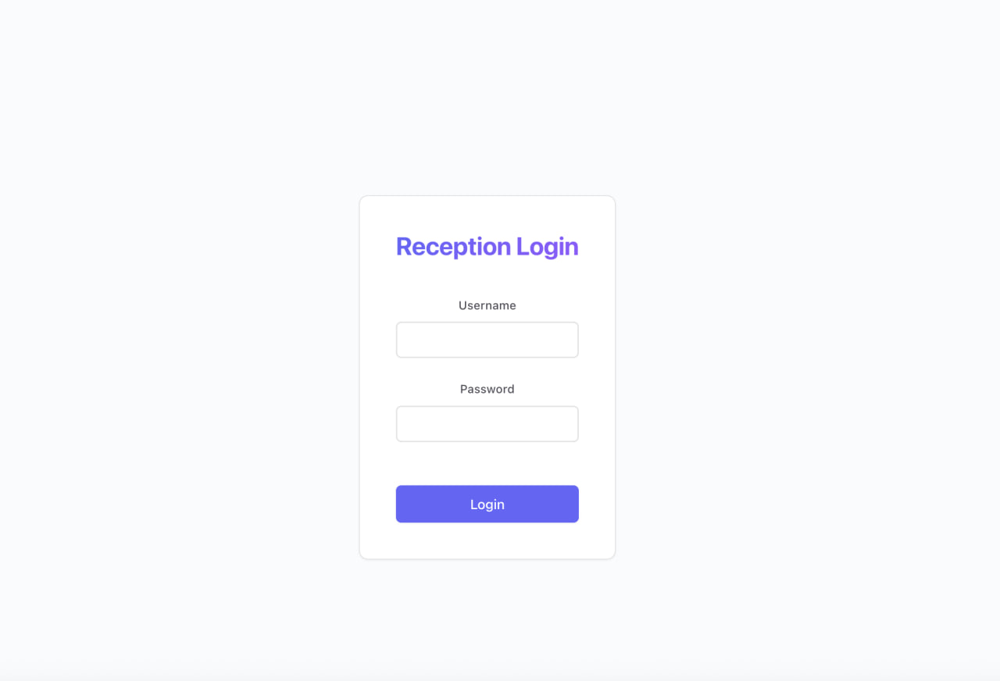
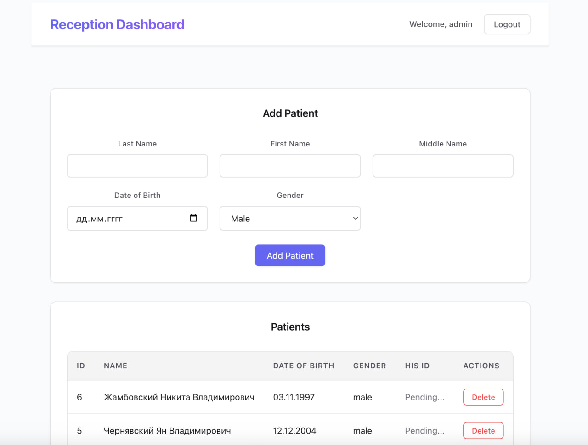

# Reception UI

Frontend для системы регистрации пациентов в медицинском учреждении.

## Технологии

- **Svelte** - реактивный UI фреймворк
- **Vite** - сборщик и dev-сервер
- **HTTPS** - самоподписанные сертификаты для dev-окружения
- **WebSocket** - real-time обновления списка пациентов

### Почему Svelte?

- **Компилятор вместо runtime** - нет лишнего кода фреймворка в браузере, меньше бандл
- **Встроенная реактивность** - не нужны useState/useMemo/useCallback, просто `let count = 0`
- **Меньше boilerplate** - `bind:value` вместо value + onChange, встроенные stores
- **Автоматическая оптимизация** - точные обновления DOM без Virtual DOM diffing

## Архитектура

```
src/
├── components/
│   ├── Login.svelte
│   ├── Dashboard.svelte
│   ├── PatientForm.svelte
│   └── PatientList.svelte
├── stores/
│   ├── auth.js
│   └── patients.js
├── services/
│   ├── api.js
│   └── websocket.js
└── styles/
    └── global.css
```

## Основная логика

### Авторизация
- JWT токены: access token (15 мин, в памяти) + refresh token (7 дней, HttpOnly cookie)
- Автоматическое обновление access token при 401
- Восстановление сессии при перезагрузке страницы через refresh token

### Работа с пациентами
- Форма добавления пациента с валидацией:
  - ФИО без цифр
  - Дата рождения от 120 лет назад до сегодня
  - Пол (male/female)
- Список пациентов с real-time обновлениями через WebSocket
- Отслеживание синхронизации HIS ID (отображается когда получен от Hospital Server)
- Удаление пациента
- Копирование HIS ID в буфер обмена по клику

### API
- Все запросы через Vite proxy (избегаем CORS)
- Автоматическая повторная попытка с обновленным токеном при истечении
- Обработка ошибок с отображением в UI

### Real-time обновления
- WebSocket подключение к Reception API (wss://localhost:8080/ws)
- Автоматическое добавление новых пациентов в таблицу
- Автоматическое удаление при получении события
- Обновление HIS ID при синхронизации с Hospital Server через HL7
- Auto-reconnect при разрыве соединения

## Скриншоты

### Страница входа


### Dashboard с формой добавления пациента и списком пациентов

